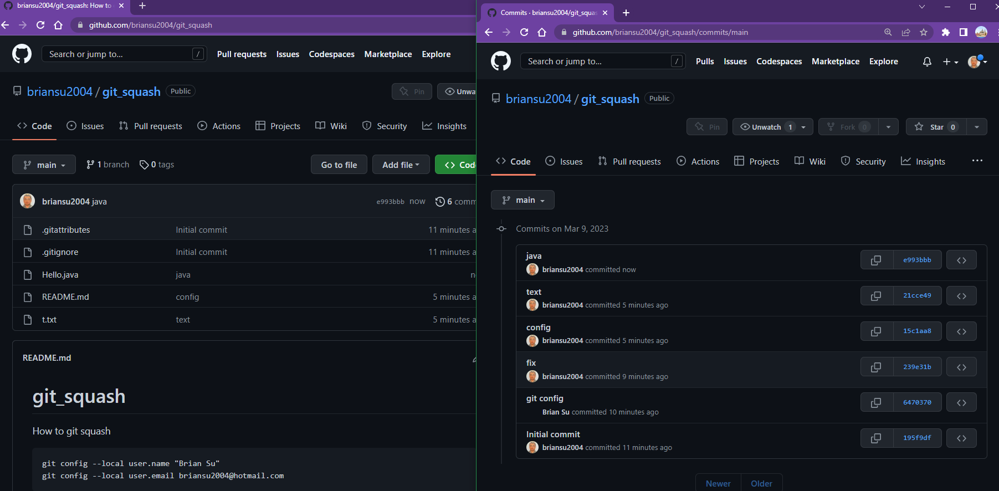

# git squash

## git squash (method #1)

How to git squash?

### Before

6 commits



### Commands

Using git rev-list:

You can use git rev-list to count the number of commits on the branch:

```bash
git rev-list --count HEAD
```

Using git log:

Run the following command to see the commit history and count the number of commits:

```bash
git log --oneline
```

Count the number of commit lines displayed in the output. This will be the value of n that you need for the interactive rebase.

6 - 1 = 5

```dos
git reset --soft HEAD~5
git commit --amend
# :q
git push -f
```

### After


## git squash (method #2)

```dos
git checkout --orphan <old_branch>

git push -u origin <branch-name>
```
