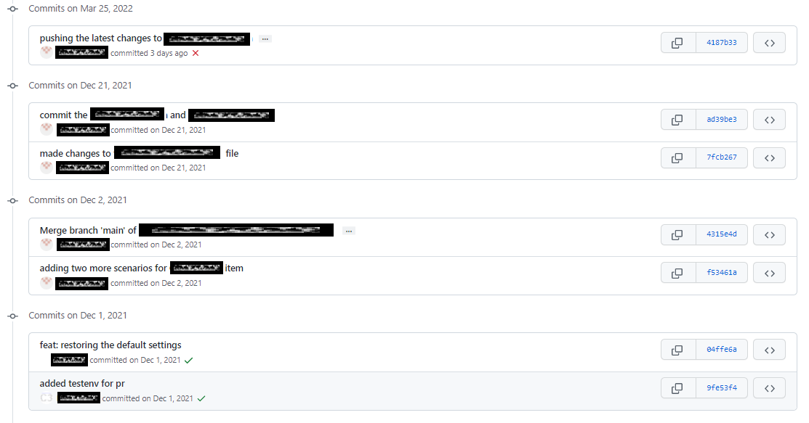

# MyGit

My Git

Very important to work in a team :-)

## git push -f

- What is `git push -f`?

You cannot push if someone pushed some commits on the same branch before you because Git cannot guess how to fix the conflict.

`git push -f` will withdraw your colleagues commits and replace the whole history with yours. This should never be used.

- What are the differences between `git push -f` and `git push`?

- How to disable `git push -f` or prevent `git push -f`?

If you have the appropriate permissions on your "central" git repository, you can disable force push by git config --system receive.denyNonFastForwards true.

For Github Enterprise, you can follow instructions on this page to disable force push.

For other Github repositories (the ones that most of us use daily), there are no ways to disable force push. Some workarounds include:

- Limiting the group of people will push privileges. Other contributions will have to come in as Pull Requests.
- Set up an intermediate repo on your side with a pre-receive hook to prevent force push.

## How to git 撤销上一次 push 的版本

<https://blog.csdn.net/m0_37605197/article/details/110919455>

可以用 git log 查看你要回到的那个版本

接着用

```dos
git reset --hard HEAD^ 回退到上个版本
```

or

```dos
git reset --hard commit_id 退到/进到 指定commit_id
```

最后将本地的修改提交到远程

```dos
git push origin HEAD --force
```

- Proof

This has been verified at Mar 27, 2022!

```dos
git log
git reset --hard 4187b33265e
git push origin HEAD --force
git log
```

### 当你回滚之后，又后悔了，想恢复到新的版本怎么办？

用 `git reflog` 打印你记录你的每一次操作记录

git reflog 可以查看所有分支的所有操作记录（包括（包括 commit 和 reset 的操作），包括已经被删除的 commit 记录，git log 则不能察看已经删除了的 commit 记录。

简单的说，它会记录所有 HEAD 的历史，也就是说当你做 reset，checkout 等操作的时候，这些操作会被记录在 reflog 中。

## How to 删除 github 文件/文件夹

经常需要删除 github 的文件或文件夹，如果仅删除文件可能还能在网站里删除（但是当要删除的文件较多的时候，一个一个删除简直要命～～～），但是删除文件夹该怎么办呢？

### 直接在网站里删除的方法如下

点击文件右上角的“删除按钮”，滑到页面最下方点击“commit changes”

找到删除按钮.png

### 通过 git 的方式删除

首先我们将整个仓库 clone 到本地

git clone <https://github.com/>***

在 clone 下来的本地仓库里初始化

git init

选择删除文件或者文件夹

git rm FILE 删除文件

git rm -r \*\*\*删除文件夹

当然这里也可以有对应的增加操作

提交上述操作

git commit -m "log message"

推送所有文件到远程仓库

git push origin master

这时候如果再执行添加 origin 操作，会提示远程 origin 已经存在。

细心的可能会发现这地方跟添加本地项目到 github 的最后一步操作不一样，那里是 git push -u origin master

第一次添加远程 origin 时，需要语句-u

这时候我们再去 github 上查看此项目，就可以看到已经更新了刚才的操作！

## How to git 获取特定的 commit

`git reset --hard [commit_id]`

- Scenario



The commit on Dec 1, 2021 works.

But the commits after don't work :-)

I need to pick the work commit then build and deploy.

- Proof

Do a fresh glone -> retrieve the particular commit -> copy to the new branch -> build and trigger from this new branch -> test and verify -> close

Commands:

```dos
cd C:\_RepoFresh\#2

git clone https://github.com/telus/bdd-jest-merlin-cloud-bss-bridge.git

cd bdd-jest-merlin-cloud-bss-bridge

git branch

git log

git reset --hard 04ffe6a42f619527eaf4fbaead8e1ab738002cff

git log

git checkout -b v1.0

git branch

git status

git push --set-upstream origin v1.0
```

Output:

```dos
C:\Code\MyGit>cd C:\_RepoFresh\#2

C:\_RepoFresh\#2>git clone https://github.com/telus/bdd-jest-merlin-cloud-bss-bridge.git
Cloning into 'bdd-jest-merlin-cloud-bss-bridge'...
remote: Enumerating objects: 213, done.
remote: Counting objects: 100% (213/213), done.
remote: Compressing objects: 100% (138/138), done.
remote: Total 213 (delta 81), reused 191 (delta 59), pack-reused 0
Receiving objects: 100% (213/213), 277.76 KiB | 4.27 MiB/s, done.
Resolving deltas: 100% (81/81), done.

C:\_RepoFresh\#2>cd bdd-jest-merlin-cloud-bss-bridge

C:\_RepoFresh\#2\bdd-jest-merlin-cloud-bss-bridge>git branch
* main

C:\_RepoFresh\#2\bdd-jest-merlin-cloud-bss-bridge>git reset --hard 04ffe6a42f619527eaf4fbaead8e1ab738002cff
HEAD is now at 04ffe6a feat: restoring the default settings

C:\_RepoFresh\#2\bdd-jest-merlin-cloud-bss-bridge>git log
commit 04ffe6a42f619527eaf4fbaead8e1ab738002cff (HEAD -> main, tag: bdd-jest-mcb-v1.0.7)
Author: tim shao <tims.shao@telus.com>
Date:   Wed Dec 1 17:16:19 2021 -0500

    feat: restoring the default settings

C:\_RepoFresh\#2\bdd-jest-merlin-cloud-bss-bridge>git checkout -b v1.0
Switched to a new branch 'v1.0'

C:\_RepoFresh\#2\bdd-jest-merlin-cloud-bss-bridge>git branch
  main
* v1.0

C:\_RepoFresh\#2\bdd-jest-merlin-cloud-bss-bridge>git status
On branch v1.0
nothing to commit, working tree clean

C:\_RepoFresh\#2\bdd-jest-merlin-cloud-bss-bridge> git push --set-upstream origin v1.0
Total 0 (delta 0), reused 0 (delta 0), pack-reused 0
remote:
remote: Create a pull request for 'v1.0' on GitHub by visiting:
remote:      https://github.com/telus/bdd-jest-merlin-cloud-bss-bridge/pull/new/v1.0
remote:
To https://github.com/telus/bdd-jest-merlin-cloud-bss-bridge.git
 * [new branch]      v1.0 -> v1.0
Branch 'v1.0' set up to track remote branch 'v1.0' from 'origin'.
```
